## Fire Prediction Model

### Data Pre-processing

The data source used in this task is from Moderate-resolution Imaging Spectroradiometer(MODIS) provided by NASA. The obtained time series data of Australia wild-fire from 2003 to 2020 is saved in CSV format. The task is to drop all data with confidence less than 80, and divide them monthly. A high threshold for confidence is adopted to reduce the noise of input data and make the prediction result more reliable. Given the intensity of wildfires, it makes sense to combine data from the same month to create heat maps. All mentioned operations are based on Pandas in Python.
The data source used in this task is from Moderate-resolution Imaging Spectroradiometer(MODIS) provided by NASA. The obtained time series data of Australia wild-fire from 2003 to 2020 is saved in CSV format. The task is to drop all data with confidence less than 80, and divide them monthly. A high threshold for confidence is adopted to reduce the noise of input data and make the prediction result more reliable. There are two main reasons for selecting monthly divided data: 

1. Monthly divided data has a long time span, which can provide a long enough time series. 

2. Monthly divided data has uniform time interval, which is convenient for statistical modeling of time series. 

All mentioned operations are based on Python's framework Pandas.

### Build Map with Fire Index

Australian Bureau of Statistics offers digital boundary files of all states. By reading the shape file and monthly wild-fire data in MATLAB R2021b, it's easy to use filterm function to drop all data points out of the state Victoria, and map all points to a 109x185 matrix, where 20 terms in each dimension corresponding to one degree in geography.

The Heatmap function can build maps in an intuitive and easily machine-learned form. By building maps for every month in 17 years, 204 maps are obtained. The figure below shows the wild fire in Victoria in 2003.

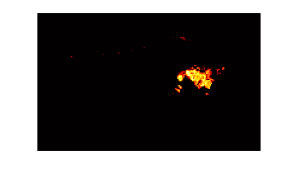

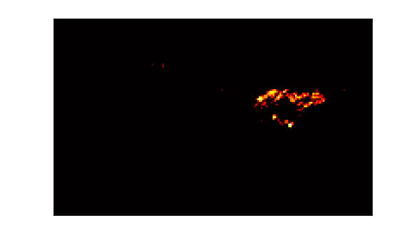

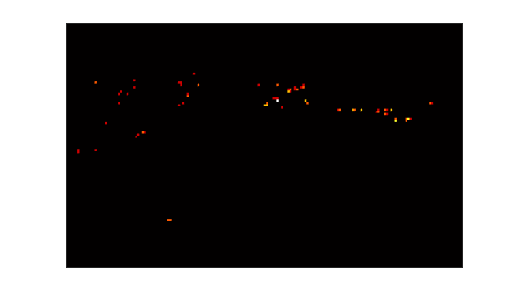

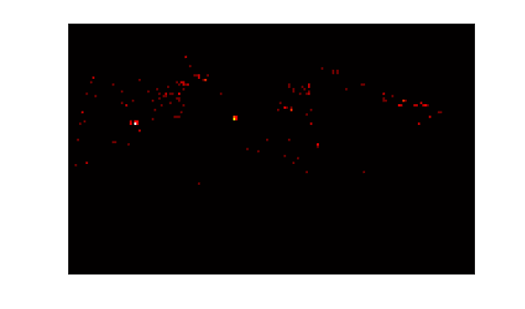

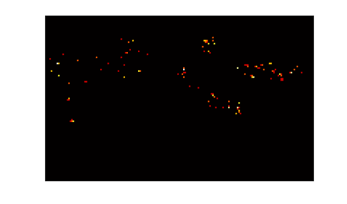

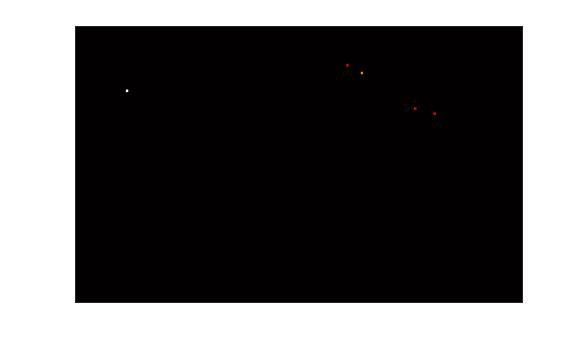

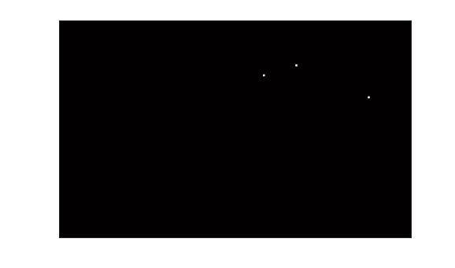

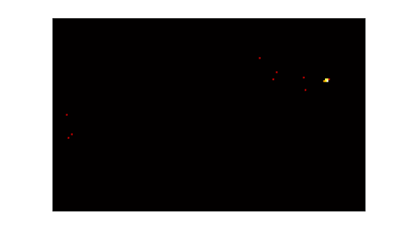

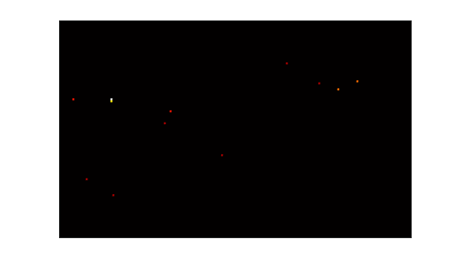

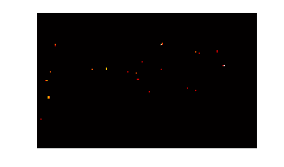

The RGB channel values in the picture are given by the following formula:
$$
\begin{equation}
R_{x,y}=\left\{
\begin{array}{**lr**}
\left \lfloor 255\frac{3\root4\of{{heat}_{x,y}}}{\max(\root4\of {heat})} \right \rfloor & \root4\of{{heat}_{x,y}}<\frac{1}{3}\max(\root4\of {heat})  \\  
255 & \root4\of{{heat}_{x,y}}\ge\frac{1}{3}\max(\root4\of {heat})
\end{array}  
\right.
\end{equation}
$$

$$
\begin{equation}
G_{x,y}=\left\{
\begin{array}{**lr**}
0&\root4\of{{heat}_{x,y}}\le\frac{1}{3}\max(\root4\of {heat})\\
\left \lfloor 255\big(\frac{3\root4\of{{heat}_{x,y}}}{\max(\root4\of {heat})}-1\big) \right \rfloor&\frac{1}{3}\max(\root4\of {heat})<\root4\of{{heat}_{x,y}}<\frac{2}{3}\max(\root4\of {heat})  \\  
255&\root4\of{{heat}_{x,y}}\ge\frac{2}{3}\max(\root4\of {heat})
\end{array}  
\right.
\end{equation}
$$

$$
\begin{equation}
B_{x,y}=\left\{
\begin{array}{**lr**}
0&\root4\of{{heat}_{x,y}}<\frac{2}{3}\max(\root4\of {heat})\\
\left \lfloor 255\big(\frac{3\root4\of{{heat}_{x,y}}}{\max(\root4\of {heat})}-2\big) \right \rfloor&\root4\of{{heat}_{x,y}}\ge\frac{2}{3}\max(\root4\of {heat})  
\end{array}  
\right.
\end{equation}
$$

### Time series construction

### ConvLSTM

Time series data prediction refers to learning past time series and predicting future changes. Traditional Neural networks cannot solve the problem of time-axis variation, so RNN (Recurrent Neural network) is developed (Jordan et al., 1997).

However, due to the poor performance of classical RNN in extracting long time series information and the limited time series information extracted, Hochreiter developed LSTM network model (Hochreiter et al.,1997). In classical RNN, gates structure is added to selectively add and delete the past timing information, and input gate, output gate and forgetting gate are added to control the input and output of data of this unit (an LSTM cell is a basic unit) and the increase and decrease of the output information of the previous unit respectively. The LSTM formula is expressed as follows:
$$
\begin{equation}
\mathbfit{i}_t=\sigma(\mathbfit{W}_{xi}\mathbfit{X}_{t}+\mathbfit{W}_{hi}\mathbfit{H}_{t-1}+\mathbfit{W}_{ci}\circ\mathbfit{C}_{t-1}+b_i)
\end{equation}
$$

$$
\begin{equation}
\mathbfit{f}_t=\sigma(\mathbfit{W}_{xf}\mathbfit{X}_{t}+\mathbfit{W}_{hf}\mathbfit{H}_{t-1}+\mathbfit{W}_{cf}\circ\mathbfit{C}_{t-1}+b_f) 
\end{equation}
$$

$$
\begin{equation}
\mathbfit{C}_t=\mathbfit{f}_{t}\circ\mathbfit{C}_{t-1}+\mathbfit{i}_t\circ\tanh(\mathbfit{W}_{xc}\mathbfit{X}_{t}+\mathbfit{W}_{hc}\mathbfit{H}_{t-1}+b_c)
\end{equation}
$$

$$
\begin{equation}
\mathbfit{o}_t=\sigma(\mathbfit{W}_{xo}\mathbfit{X}_{t}+\mathbfit{W}_{ho}\mathbfit{H}_{t-1}+\mathbfit{W}_{co}\circ\mathbfit{C}_{t-1}+b_o)
\end{equation}
$$

ConvLSTM is a variant of LSTM proposed on the basis of LSTM. It replaces the fully connected state between the input layer and the hidden layer and between the hidden layer and the hidden layer of LSTM with the convolution connection, which makes full use of the spatial information that LSTM cannot. LSTM needs to transform image data into one-dimensional vector when processing image data, and cannot process spatial structure information of original image data. Compared with LSTM model,Conv LSTM can better extract spatial and temporal structure information from time series images. ConvLSTM model formula is expressed as follows:

$$
\begin{equation}
\mathbfit{i}_t=\sigma(\mathbfit{W}_{xi}*\mathbfit{X}_{t}+\mathbfit{W}_{hi}*\mathbfit{H}_{t-1}+\mathbfit{W}_{ci}\circ\mathbfit{C}_{t-1}+b_i)
\end{equation}
$$

$$
\begin{equation}
\mathbfit{f}_t=\sigma(\mathbfit{W}_{xf}*\mathbfit{X}_{t}+\mathbfit{W}_{hf}*\mathbfit{H}_{t-1}+\mathbfit{W}_{cf}\circ\mathbfit{C}_{t-1}+b_f) 
\end{equation}
$$

$$
\begin{equation}
\mathbfit{C}_t=\mathbfit{f}_{t}\circ\mathbfit{C}_{t-1}+\mathbfit{i}_t\circ\tanh(\mathbfit{W}_{xc}*\mathbfit{X}_{t}+\mathbfit{W}_{hc}*\mathbfit{H}_{t-1}+b_c)
\end{equation}
$$

$$
\begin{equation}
\mathbfit{o}_t=\sigma(\mathbfit{W}_{xo}*\mathbfit{X}_{t}+\mathbfit{W}_{ho}*\mathbfit{H}_{t-1}+\mathbfit{W}_{co}\circ\mathbfit{C}_{t-1}+b_o)
\end{equation}
$$

The symbol meaning in the formula is the same as that in LSTM. The full connection of input variables is replaced by convolution operation. According to the internal structure of ConvLSTM in figure, it can be seen that input gate, output gate and forgetting gate all carry out convolution operation for input and hidden layer.

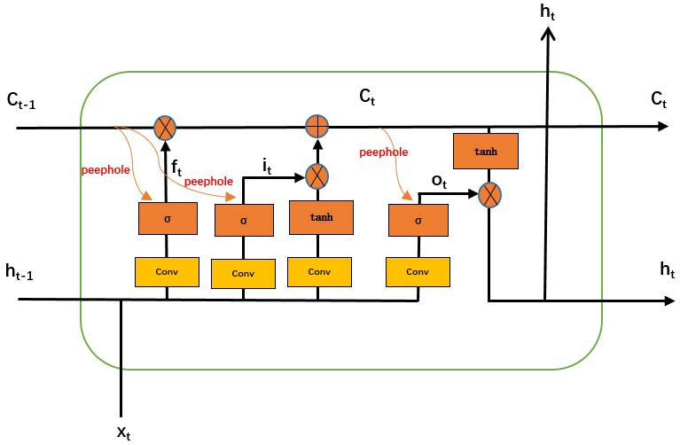

$\mathbfit{W}_{ci}\circ\mathbfit{C}_{t-1}$, $\mathbfit{W}_{cf}\circ\mathbfit{C}_{t-1}$ and $\mathbfit{W}_{co}\circ\mathbfit{C}_{t-1}$ in the formula indicate that the input, output and forgetting gates are connected to the Peephole(Gers et al., 2000) of the previous cellular state. As shown in the figure, the Peephole connection adds cell state information to each gate. Since the unit may have a door state of 0, which results in a lack of important information, adding the Peephole operation can improve this shortcoming.

Based on the deep learning framework Pytorch, the ConvLSTM is constructed using Python language, and the experimental equipment environment is NVIDIA GeForce GTX1080 GPU.

### Model Fitting